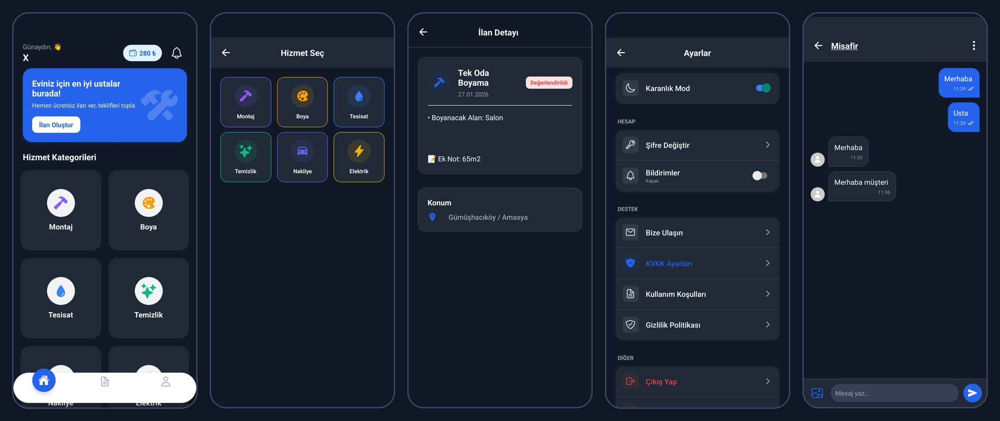
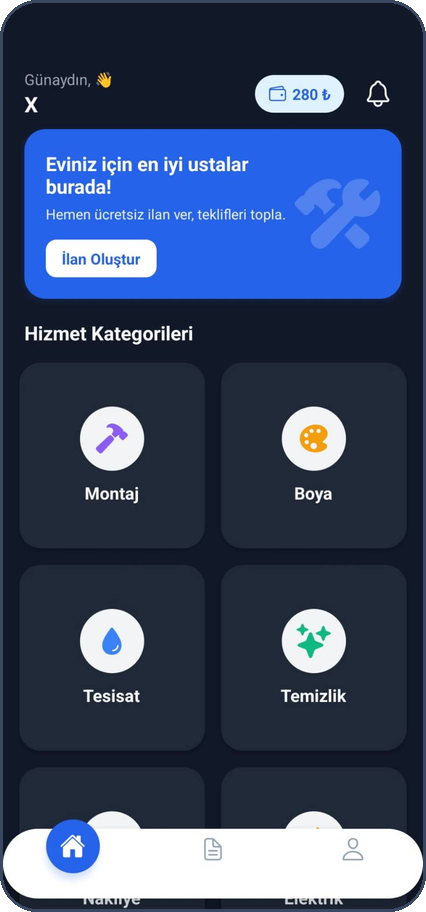
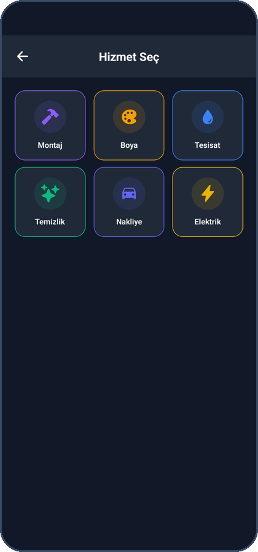
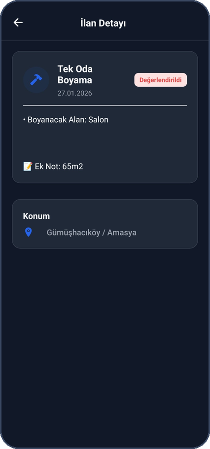
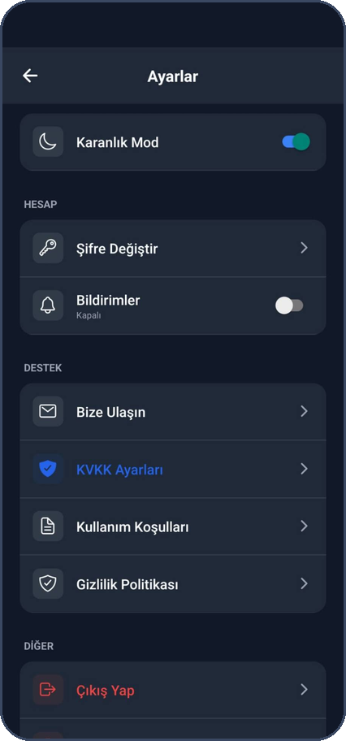
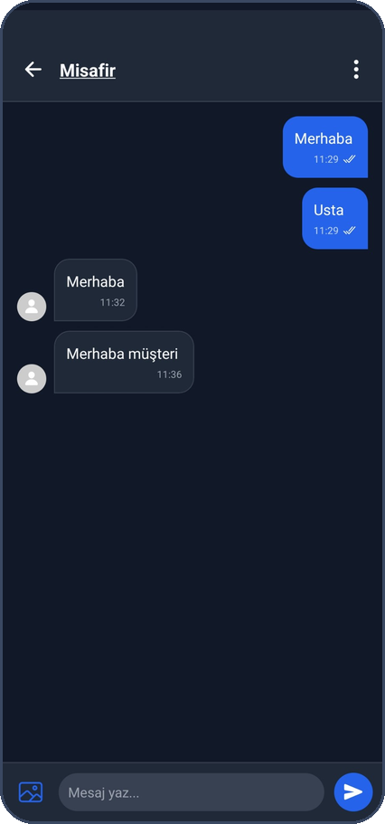

# UstaBul

Müşterileri yakındaki ustalarla buluşturan iki taraflı (müşteri / usta) bir mobil hizmet pazaryeri. Müşteri ilan açar, ustalar teklif verir; teklif kabulünden işin tamamlanmasına ve değerlendirmeye kadar tüm süreç uygulama içinde yürür.

> **Durum:** Android sürümü Google Play'de kapalı testte. Kaynak kod inceleme / portfolyo amacıyla paylaşılmıştır; izinsiz ticari kullanım ve dağıtım hakkı saklıdır.

## Ekran görüntüleri

<p align="center">
  
</p>

| | | | | |
|:---:|:---:|:---:|:---:|:---:|
|  |  |  |  |  |
| Ana ekran ve hizmet kategorileri | Hizmet seçimi | İlan detayı | Ayarlar, KVKK ve yasal metinler | Müşteri – usta mesajlaşma |

## Özellikler

- **İlan ve teklif akışı:** kategori bazlı ilan (montaj, boya, tesisat, temizlik, nakliye, elektrik), fotoğraflı ilan, usta teklifleri, teklif kabulü, iş takibi, tamamlama ve puan / yorum
- **Gerçek zamanlı mesajlaşma** ve uygulama içi bildirimler, push bildirimler
- **Usta abonelik sistemi:** RevenueCat ile abonelik, güven (onaylı) rozeti, aboneliği olmayan ustalar için teklif limiti
- **Cüzdan / bakiye:** Cloud Functions üzerinde sunucu taraflı ödeme akışı (iyzico, varsayılan olarak sandbox)
- **Konum:** il / ilçe bazlı ilanlar, harita ve konum servisleri
- **Dijital sözleşme** ve **KVKK** onay / talep yönetimi
- E-posta ve telefon ile giriş, açık / koyu tema, onboarding

## Teknoloji

| Alan | Kullanılanlar |
|---|---|
| Mobil | React Native 0.81, Expo SDK 54, React 19, React Navigation 7, Reanimated 4 |
| Backend | Firebase Auth, Firestore, Storage, Cloud Functions (Node.js) |
| Ödeme / abonelik | RevenueCat, iyzico |
| Harita / konum | Google Maps, expo-location |
| Yayın | EAS Build (AAB), Google Play Console |

## Kurulum

```bash
npm install
cp .env.example .env        # değerleri doldurun
npx expo run:android
```

- Firebase: kendi Firebase projenizin `google-services.json` dosyasını proje köküne koyun (repoya eklenmez).
- Google Maps anahtarı `GOOGLE_MAPS_API_KEY` ortam değişkeninden okunur (yerelde `.env`, EAS'te `eas env:create`). Anahtarı Google Cloud'da paket adı ve SHA-1 ile kısıtlayın.
- Cloud Functions: `functions/.env.example` dosyasını `functions/.env` olarak kopyalayın; canlıda anahtarları Firebase Secret Manager ile verin.

## Güvenlik notları

- Anahtarlar ve gizli bilgiler kaynak koda yazılmaz; `.env`, `google-services.json` ve `functions/.env` git'e eklenmez.
- Ödeme çağrıları yalnızca kimliği doğrulanmış kullanıcılar için sunucu tarafında (Cloud Functions) yapılır.
- "Beni hatırla" yalnızca e-postayı saklar; şifre cihazda tutulmaz.
- Firestore ve Storage güvenlik kuralları repodadır (`firestore.rules`, `storage.rules`): sohbetler yalnızca iki katılımcıya açıktır, kullanıcı / ilan / teklif yazmaları rol ve alan bazlı kısıtlanmıştır.
- Bilinen sınır: cüzdan bakiyesi ve abonelik alanları şu an istemciden yazılmaktadır; sunucu tarafına (Cloud Functions) taşınması planlanmıştır.

## Geliştirici

Enes Celalettin Aldemir · [GitHub](https://github.com/ennesa) · [LinkedIn](https://linkedin.com/in/enescaldemir)
